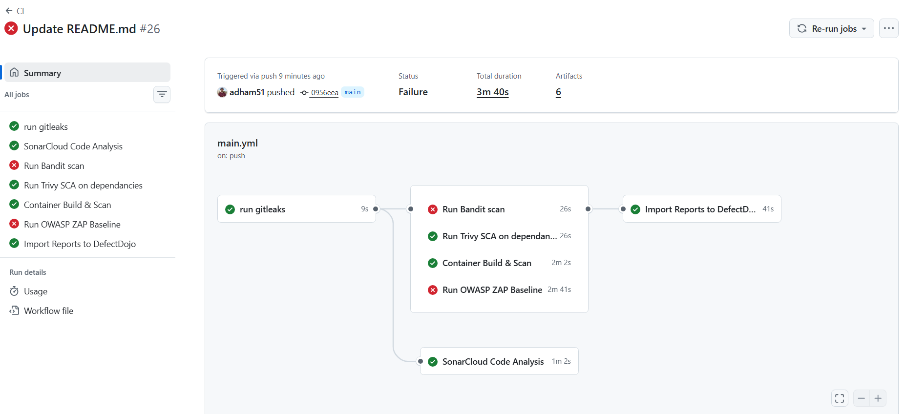
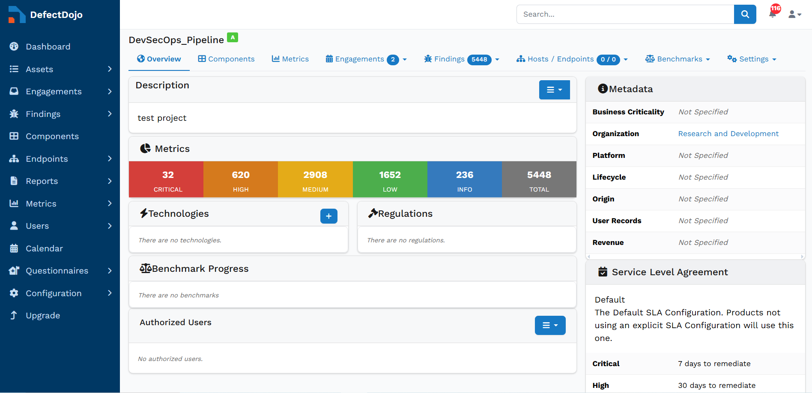
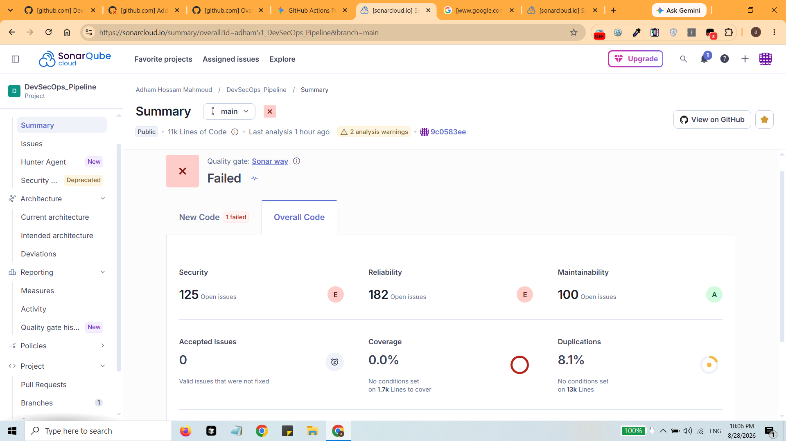
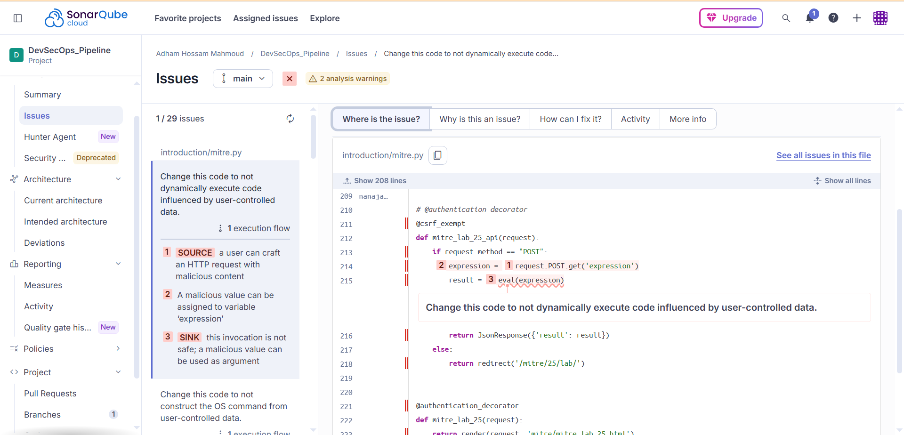
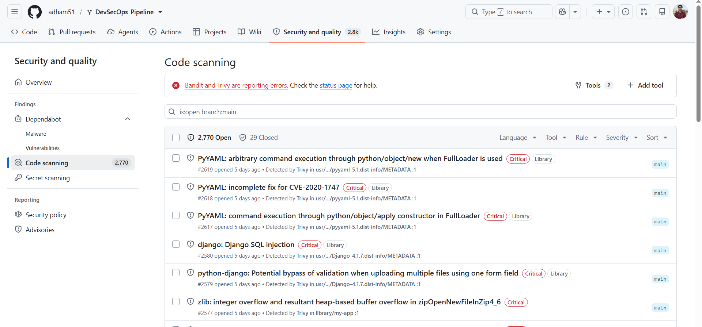

# Automated DevSecOps Pipeline (ASPM)

This project implements an automated DevSecOps pipeline using GitHub Actions to scan PyGoat, an intentionally vulnerable Django web application. The CI workflow integrates secret scanning, SAST, SCA, container analysis, and DAST to uncover vulnerabilities across all application layers. All scan results are then centralized into DefectDojo, providing a unified Application Security Posture Management (ASPM) dashboard.

## Key Features & Objectives

*   **Shift-Left Security:** Integrates security checks early in the SDLC, reducing risk and avoiding costly late-stage remediation.
*   **Comprehensive Coverage:** Utilizes multiple tools of specialized open-source security tools for diverse scanning (Secrets, SAST, SCA, Container, DAST).
*   **Centralized Vulnerability Management:** Uses DefectDojo to merge, deduplicate, and track all tool findings in one place.
*   **Automated Workflow:** Fully automated CI pipeline triggered on code pushes, ensuring consistent security evaluation.

## Architecture & Tools

The pipeline is orchestrated via GitHub Actions and employs the following security tools in parallel and sequential stages:

1.  **Secret Scanning:** `Gitleaks` (Detects hardcoded secrets, passwords, and API keys).
2.  **Code Quality & SAST (Static Application Security Testing):**
    *   `SonarQube Cloud` (Analyzes code for bugs, vulnerabilities, code smells, and provides fixes).
    *   `Bandit` (Identifies common security issues in Python code).
3.  **SCA (Software Composition Analysis):** `Trivy` (Scans project dependencies for known vulnerabilities and generates an SBOM).
4.  **Container Security:** `Trivy` (Scans the built Docker image for OS and library vulnerabilities).
5.  **DAST (Dynamic Application Security Testing):** `OWASP ZAP Baseline` (Actively scans the running web application for vulnerabilities like XSS and SQLi).
6.  **ASPM (Application Security Posture Management):** `DefectDojo` (Central dashboard for importing, managing, and tracking all scan results).

## Pipeline Workflow

*Figure 1: GitHub Actions executing security scanners. Note: Bandit and OWASP ZAP intentional failures act as Security Quality Gates blocking vulnerable code from progression while still completing ASPM reporting.*
Pipeline Workflow: Uses parallel jobs to run scanners at the same time and save execution time:

*   **Phase 1: Secret Scanning:** Runs first to ensure no sensitive data is leaked before further processing.
*   **Phase 2: Parallel Analysis (SAST, SCA, DAST):** If no secrets are found, SonarCloud, Bandit, Trivy (Dependency & Container), and OWASP ZAP run concurrently.
*   **Phase 3: Centralized Reporting:** Upon completion of all scans, the `defectdojo_import` job aggregates the SARIF and HTML reports and pushes them to the DefectDojo API.

## Security Dashboards & Metrics

### Centralized ASPM Dashboard (DefectDojo)
DefectDojo pulls findings from all scanners into one place, removes duplicate alerts, and provides a unified view of the app's overall security posture.

*Figure 2: Centralized vulnerability metrics across all integrated tools in DefectDojo.*

### Code Quality & SAST Analysis (SonarCloud)
SonarCloud evaluates overall code quality, technical debt, and provides developer-friendly remediation guidance directly in the source code.

*Figure 3: SonarCloud overall quality gate and maintainability metrics.*

*Figure 4: Developer-friendly SAST breakdown highlighting execution flow (Source to Sink) and remediation guidance.*

### GitHub Security Code Scanning
SARIF outputs from Trivy and Bandit integrate directly into GitHub's native security tab.

*Figure 5: Native SARIF reports integrated into GitHub Code Scanning alerts.*

## Troubleshooting & Technical Challenges

**1. Artifact sharing across runners**
- **Problem:** Scan jobs ran on separate VMs, so the reporting job (`defectdojo_import`) couldn't access reports from other jobs.
- **Solution:** Used `upload-artifact@v4` in scan jobs and `download-artifact@v4` in the reporting job to collect everything into a shared `./reports` folder.

**2. Pipeline stopping on failed scans**
- **Problem:** Bandit and ZAP exit with an error code on high-severity findings, which stopped the pipeline before reporting could run.
- **Solution:** Added `if: always()` to the `defectdojo_import` job so it still runs and uploads findings even if a scan step fails.

**3. False positives from scanners**
- **Problem:** Bandit and Trivy flagged test files and vendor/third-party code as vulnerabilities, adding noise.
- **Solution:** Used a `.trivyignore` file to skip known false positives and non-actionable CVEs.

**4. DAST target not ready**
- **Problem:** ZAP scans failed intermittently with connection timeouts since the PyGoat container was still booting/migrating.
- **Solution:** Added a pre-scan health-check (`docker ps`, `docker logs`, 15s wait) to confirm the container was healthy before scanning.

---
*Developed by Adham Abo El-Magd | [[LinkedIn Profile](https://www.linkedin.com/in/adham-hossam-abol-magd/)]*
